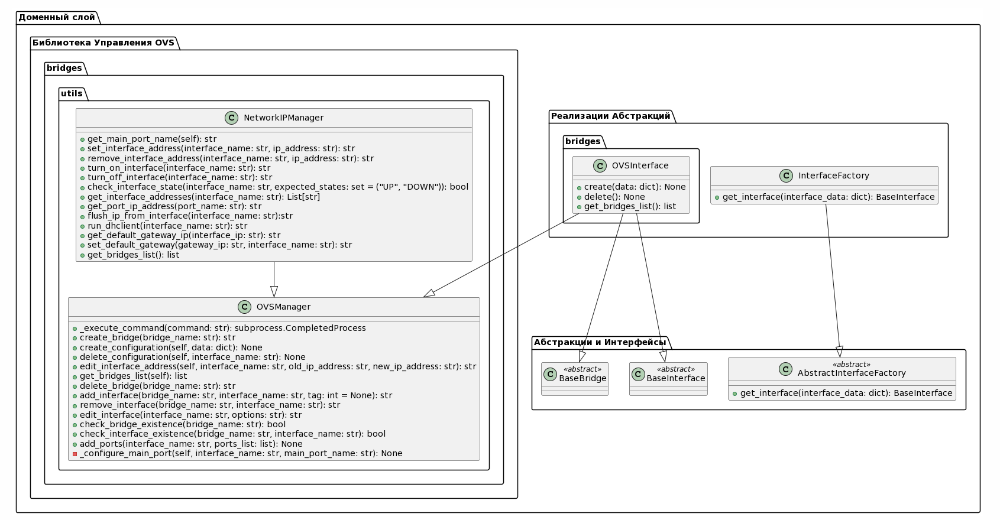
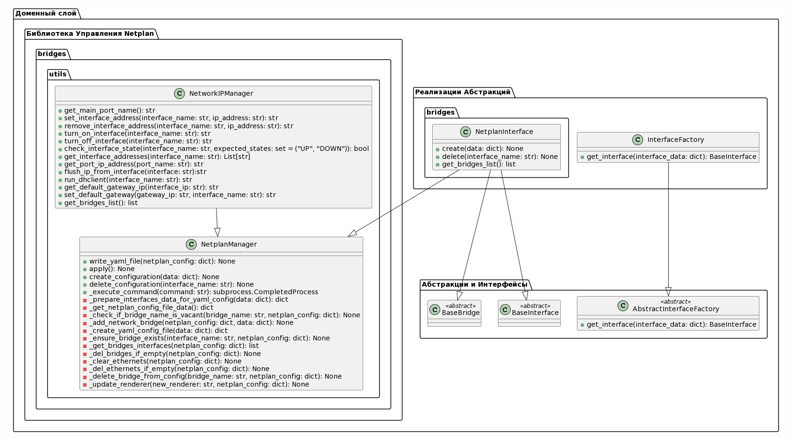

Здесь представлена пользовательская информация по работе с сетевыми
интерфейсами.

## Open vSwitch

[Open vSwitch](https://docs.openvswitch.org/) — программный многоуровневый
коммутатор с открытым исходным кодом, предназначенный для работы в гипервизорах
и на компьютерах с виртуальными машинами.

Модуль управления сетевыми интерфейсами предоставляет функциональность
для создания, управления и удаления сетевых интерфейсов и мостов с
использованием Open vSwitch (OVS). Он включает в себя гибкую фабрику
интерфейсов для создания различных типов сетевых интерфейсов и набор классов
для управления мостами и интерфейсами OVS.

### Доменный слой

#### Абстракции и Интерфейсы

Модуль: model

1. AbstractInterfaceFactory - это абстрактный класс, представляющий
   фабрику для создания объектов класса BaseInterface/BaseBridge. Включает
   в себя абстрактный метод get_interface, который должен быть реализован
   конкретными подклассами.

Методы:

get_interface(interface_data: dict):
Абстрактный метод для создания и возвращения объекта класса
BaseInterface/BaseBridge на основе предоставленных данных об интерфейсе.

Модуль: base

1. BaseInterface - абстрактный класс, представляющий собой общий
   сетевой интерфейс. Служит базовым классом для различных типов сетевых
   интерфейсов.

2. BaseBridge - абстрактный базовый класс, представляющий собой общий
   сетевой мост. Служит базовым классом для различных типов сетевых мостов.

#### Реализации Абстракций

Модуль: model

1. InterfaceFactory - это конкретная реализация AbstractInterfaceFactory,
   отвечающая за создание экземпляров различных типов сетевых интерфейсов.

Методы:

get_interface(interface_data: dict): Создает и
возвращает объект класса BaseInterface/BaseBridge на основе предоставленных
данных об интерфейсе. Используется отображение типов интерфейсов на их
соответствующие классы для создания экземпляров.

Поддомен: bridges | Модуль: ovs_bridge

1. OVSInterface - класс, представляющий интерфейс OVS и реализующий
   управление виртуальными сетевыми мостами.

Методы:

create(self, data: dict) -> None: Создает новый мост OVS и настраивает
его параметры в соответствии с переданными данными.

delete(self) -> None: Удаляет существующий OVS мост.

get_bridges_list(self) -> list: Получает список подключенных сетевых мостов.
Возвращает список с данными о подключенных сетевых мостах.

#### Библиотека управления OVS

Поддомен: bridges.utils | Модуль: ovs_lib

1. OVSManager - класс, предоставляющий методы для управления мостами и
   интерфейсами OVS. Включает в себя функционал по созданию/удалению
   мостов, добавлению/удалению интерфейсов, управлению IP-адресами и
   другие операции.

Поддомен: bridges.utils | Модуль: ip_manager

2. NetworkIPManager - вспомогательный класс для взаимодействия с такими
   базовыми утилитами как: ip, dhclient и т.д.

#### Диаграмма UML

# Netplan Interface

## Netplan

[Netplan](https://netplan.readthedocs.io/) - это утилита для настройки сетевых
соединенийв современных дистрибутивах Linux.

Модуль управления сетевыми интерфейсами с использованием Netplan предоставляет
функциональность для создания, управления и удаления сетевых интерфейсов и
мостов с использованием утилиты Netplan. Он включает гибкую фабрику интерфейсов
для создания различных типов сетевых интерфейсов и набор классов для управления
мостами и интерфейсами Netplan.

## Доменный слой

### Абстракции и Интерфейсы

Модуль: model

1. AbstractInterfaceFactory - Абстрактный класс, представляющий собой
   фабрику для создания объектов класса BaseInterface и BaseBridge.
   Включает в себя абстрактный метод get_interfac, который должен быть
   реализован конкретными подклассами.

**Методы:**

- get_interface(interface_data: dict): Абстрактный метод для создания и
  возвращения объекта класса BaseInterface или BaseBridge на основе
  предоставленных данных об интерфейсе.

Модуль: base

1. BaseInterface - Абстрактный класс, представляющий собой общий сетевой
   интерфейс. Служит базовым классом для различных типов сетевых интерфейсов.

2. BaseBridge - Абстрактный базовый класс, представляющий собой общий
   сетевой мост. Служит базовым классом для различных типов сетевых мостов.

### Реализации Абстракций

Модуль: model

1. InterfaceFactory - Конкретная реализация AbstractInterfaceFactory,
   отвечающая за создание экземпляров различных типов сетевых интерфейсов.

**Методы:**

- get_interface(interface_data: dict): Создает и возвращает объект класса
  BaseInterface\` или BaseBridge на основе предоставленных данных об
  интерфейс. Использует отображение типов интерфейсов на соответствующие классы
  для создания экземпляров.

Поддомен: bridges | Модуль: netplan

1. NetplanInterface

- Класс, представляющий интерфейс Netplan и реализующий управление
  виртуальными сетевыми мостами.

**Методы:**

- create(self, data: dict) - Создает новый мост Netplan и настраивает
  его параметры в соответствии с переданными данными.

- delete(self): Удаляет существующий мост Netplan.
- get_bridges_list(self) - Получает список подключенных сетевых мостов.
  Возвращает список с данными о подключенных сетевых мостах.

### Библиотека управления netplan

Поддомен: bridges.utils | Модуль: netplan_lib

1. NetplanManager - класс, предоставляющий методы для управления
   интерфейсами с помощью утилиты netplan.

Поддомен: bridges.utils | Модуль: ip_manager

2. NetworkIPManager - вспомогательный класс для взаимодействия с такими
   базовыми утилитами как: ip, dhclient и т.д.

### Диаграмма UML

