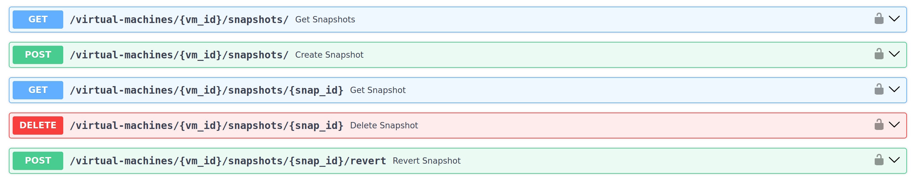

# Снапшоты виртуальных машин

Функционал снимков (**снапшотов, snapshots**) виртуальных машин является частью модуля 
виртуальных машин (**Virtual Machines**) и предоставляет возможность создания, удаления 
снапшотов, получения информации о снапшотах, а также отката (восстановления) состояния 
виртуальных машин к снапшотам. 

Снапшоты позволяют сохранять текущее состояние ВМ, включая данные на дисках, 
конфигурацию и память, с возможностью последующего восстановления этого состояния.
Важно отметить, что на данный момент реализован функционал **internal**-снапшотов, 
которые сохраняют данные на том же файле диска виртуальной машины **`.qcow2`**.

### Особенности реализации:

- Снапшоты создаются для конкретной виртуальной машины (**не более 10 снапшотов на ВМ**).
- Все операции со снапшотами доступны **только с запущенной ВМ** 
  (кроме операции удаления, которая доступна всегда).
- Создание снапшотов возможно только для дисков `.qcow2`, нет поддержки `raw`-дисков.
- Контролируются статусы снапшотов: `creating`, `running`, `reverting`, `deleting`, `error`.
- Автоматическая маркировка текущего снапшота флагом `is_current`.
- Автоматически поддерживается древовидная связь снапшотов.
- Реализовано восстановление снапшотов после перезагрузки виртуальных машин.


## API

Для удобства отправки запросов к эндпоинтам можно использовать **Swagger UI**, 
доступный по адресу **https://localhost:8000/swagger#/**.



### **Получение списка снапшотов виртуальной машины**

> GET /virtual-machines/{vm_id}/snapshots/

Эндпоинт возвращает список всех снапшотов виртуальной машины по её
идентификатору.

### **Получение информации о снапшоте**

> GET /virtual-machines/{vm_id}/snapshots/{snap_id}

Эндпоинт возвращает информацию о конкретном снапшоте по идентификатору
виртуальной машины и идентификатору снапшота.

### **Создание снапшота**

> POST /virtual-machines/create/

Эндпоинт создаёт снапшот виртуальной машины по её идентификатору,
требует указания имени и (опционально) описания нового снапшота.

Допускается создание **не более 10 снапшотов** каждой виртуальной машины 
(ввиду существенного снижения производительности).

**Пример запроса:**

> curl -X 'POST' \
>   'https://localhost:8000/virtual-machines/3fa85f64-5717-4562-b3fc-2c963f66afa6/snapshots/' \
>   -H 'accept: application/json' \
>   -H 'Content-Type: application/json' \
>   -d '{
>   "name": "string",
>   "description": "string"
> }'

### **Удаление снапшота**

> DELETE /virtual-machines/{vm_id}/snapshots/{snap_id}

Эндпоинт удаляет снапшот по идентификатору
виртуальной машины и идентификатору удаляемого снапшота.

### **Откат (восстановление машины) к состоянию снапшота**

> POST /virtual-machines/{vm_id}/start/

Эндпоинт восстанавливает состояние виртуальной машины 
к состоянию на момент создания снапшота по идентификатору 
виртуальной машины и идентификатору снапшота.

---

### Формат информации о снапшоте (в ответах на запросы к API)


```
vm_id (UUID): ID виртуальной машины.
id (UUID): ID снапшота.
vm_name (str): Имя (название) виртуальной машины.
name (str): Имя (название) снапшота.
parent (Optional[str]): Имя родителя (parent) снапшота.
description (Optional[str]): Описание снапшота (опционально).
created_at (str): Время создания.
is_current (bool): Является ли снапшот текущим (current).
status (str): Статус снапшота.
```

---

> **См. также:** [FAQ](./../reference/modules/snapshots/faq.md)