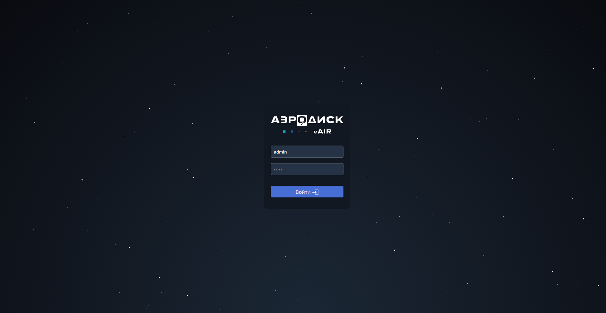
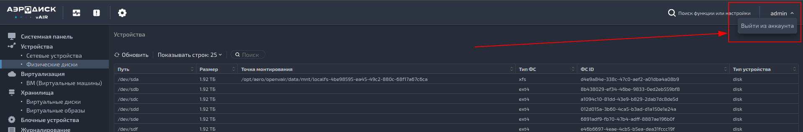

Документация описывает методы управления пользователями в системе с
использованием модуля User. Модуль User предоставляет возможность создания,
удаления и изменения учетных записей пользователей в системе.

Управление пользователями является важной частью администрирования
современных информационных систем. Позволяя администраторам эффективно
управлять доступом пользователей к ресурсам и данным, модуль User
обеспечивает безопасность и надежность системы.

## Описание функционала модуля User

### Добавление логина и пароля

Перед установкой проекта Open vAIR необходимо указать логин и пароль для
пользователя в файле project_config.toml в секции [default_user]:

```toml
[default_user]
login = 'admin'
password = 'admin'
```

После добавления логина и пароля запустите процесс установки Open vAIR.

### API

Open vAIR предоставляет следующие эндпоинты для работы с пользователями:

1. Получение текущего пользователя
2. Создание нового пользователя
3. Удаление пользователя
4. Изменение пароля пользователя

Подробные описания каждого эндпоинта и их использование приведены ниже.

#### Получение текущего пользователя

**URL:** /user/

**Метод:** GET

**Описание:** Получение информации о текущем аутентифицированном пользователе.

**Параметры запроса:**

- None

**Возвращаемый результат:**

- Объект пользователя в формате JSON.

**Пример использования:**

```bash
curl -X GET http://example.com/user/
```

#### Создание нового пользователя

**URL:** /user/{user_id}/create/

**Метод:** POST

**Описание:** Создание нового пользователя и возврат его учетных данных.

**Параметры запроса:**

- user_id (обязательный): Идентификатор текущего пользователя.

**Параметры тела запроса:**

- Данные нового пользователя в формате JSON.

**Возвращаемый результат:**

- Учетные данные созданного пользователя в формате JSON.

**Пример использования:**

```bash
curl -X POST -d '{"username": "new_user", "password": "new_password"}' http://example.com/user/1234/create/
```

#### Удаление пользователя

**URL:** /user/{user_id}/

**Метод:** DELETE

**Описание:** Удаление пользователя из базы данных.

**Параметры запроса:**

- user_id (обязательный): Идентификатор пользователя для удаления.

**Возвращаемый результат:**

- Результат операции удаления в формате JSON.

**Пример использования:**

```bash
curl -X DELETE http://example.com/user/1234/
```

#### Изменение пароля пользователя

**URL:** /user/{user_id}/change-password/

**Метод:** POST

**Описание:** Изменение пароля пользователя.

**Параметры запроса:**

- user_id (обязательный): Идентификатор пользователя для изменения пароля.

**Параметры тела запроса:**

- Новый пароль пользователя в формате JSON.

**Возвращаемый результат:**

- Результат операции изменения пароля в формате JSON.

**Пример использования:**

```bash
curl -X POST -d '{"new_password": "new_password"}' http://example.com/user/1234/change-password/
```

## Сценарии использования:

### Логин в проект

1. Для входа в проект необходимо ввести логин и пароль затем нажать на кнопку
   «Войти»:
   

### Выход из учетной записи

1. Для выхода из проекта необходимо нажать на стрелочку в верхнем правом углу и
   нажать «Выйти из аккаунта»
   
