## Введение

Здесь представлен пользовательский гайд по созданию и управлению виртуальными сетями,
порт-группами на создаваемыми для мостов OVS

Данный функционал предоставляет возможность создание виртуальных сетей(VLAN),
подключаемых к OVS мосту. Реализация сделана на основе конфигураций xml для виртуальных
сетей в lib-virt.

## Основные понятия

- **portgroup(порт группа)** - по сути и есть vlan в его привычном понимании, в рамках
  терминологии lib-virt.
- **vlan** - является частью конфигурации порт группы, отвечает за тип
  порта(access или trunk)
- **tag id** - числовой идентификатор сети. Если порт access, то vlan содержит 1 тэг,
  если trunk, то указывается необходимое количество тэгов для порта.

## Подготовка

Перед созданием виртуальной сети, в системе должен быть создан интерфейс, являющийся OVS
мостом

## Создание

Для создания виртуальной сети нужно указать следующие параметры

Параметры виртуальной сети:
: - network_name - имя сети
- forward_mode - в текущей реализации всегда bridge
- bridge - имя моста OVS на котором будет создана виртуальная сеть
- virtual_port_type - типы виртуальных портов, в текущей реализации всегда openvswitch
- port_groups - Список порт групп. Включает в себя информацию обо всех порт-группах, которые должны
относиться к данной сети
> Параметры порт группы:
> : - port_group_name - Уникальное имя порт-группы
>   - is_trunk - значения yes or no, отражающие является ли данная порт группа транковой
>     при значении yes, или же access при значении no или его отсутствии
>   - tags - список тэгов для транковой порт группы, или же список с одним тэгом для access порт группы

## Пример итогово XML файла для создания виртуальной сети

```xml
<network connections="1">
    <name>ovs-virtnet</name>
    <uuid>203616c8-c2ff-4f6b-ba14-dfb13951d492</uuid>
    <forward mode="bridge"/>
    <bridge name="test-br"/>
    <virtualport type=" openvswitch"/>
    <portgroup name="vlan-10">
        <vlan>
            <tag id="10"/>
        </vlan>
    </portgroup>
    <portgroup name="vlan-20">
        <vlan>
            <tag id="20"/>
        </vlan>
    </portgroup>
    <portgroup name="vlan-30">
        <vlan>
            <tag id="30"/>
        </vlan>
    </portgroup>
    <portgroup name="vlan-40">
        <vlan>
            <tag id="40"/>
        </vlan>
    </portgroup>
    <portgroup name="vlan-50">
        <vlan>
            <tag id="50"/>
        </vlan>
    </portgroup>
    <portgroup name="vlan-90">
        <vlan>
            <tag id="90"/>
        </vlan>
    </portgroup>
    <portgroup name="trunk">
        <vlan trunk="yes">
            <tag id="30"/>
            <tag id="40"/>
            <tag id="50"/>
        </vlan>
    </portgroup>
</network>
```

## Сценарии использования

### Создание виртуальной сети

> 1. Перейдите во вкладку «Виртуализация», «Виртуальные сети» и
     > нажмите на кнопку «Создать»:

> 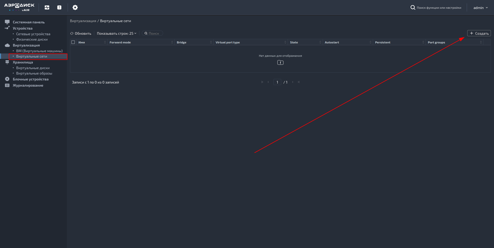
> 1. В открывшемся модальном окне введите нужные вам параметры, после чего нажмите
     > на кнопку «Добавить» для добавления портгруппы:

> 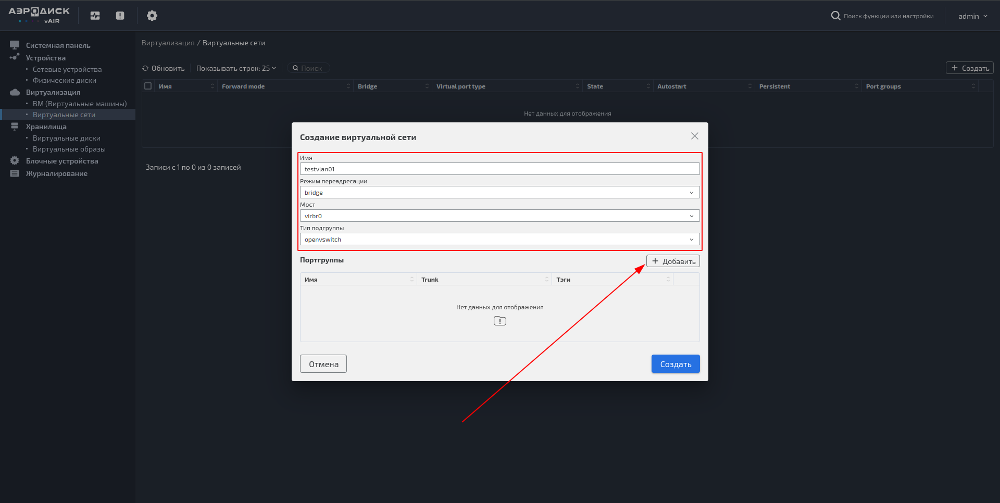
> 1. Укажите имя портгруппы и в поле «Теги» введите нужный вам тег, после чего нажмите
     > enter. Если нужно добавить еще тег, то введите его номер и снова нажмите enter. После
     > того как вы ввели нужные вам теги, нажмите на кнопку «Добавить»:

> 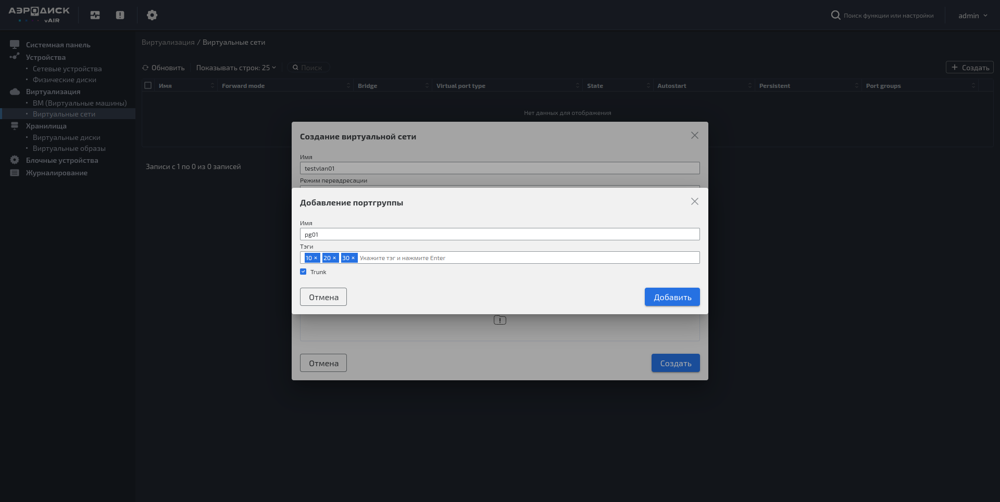
> 1. В поле «Портгруппы» модального окна создания виртуальной сети можно видеть созданную
     > портгруппу. Теперь можно нажать на кнопку «Создать» для завершения создания виртуальной
     > сети:

> 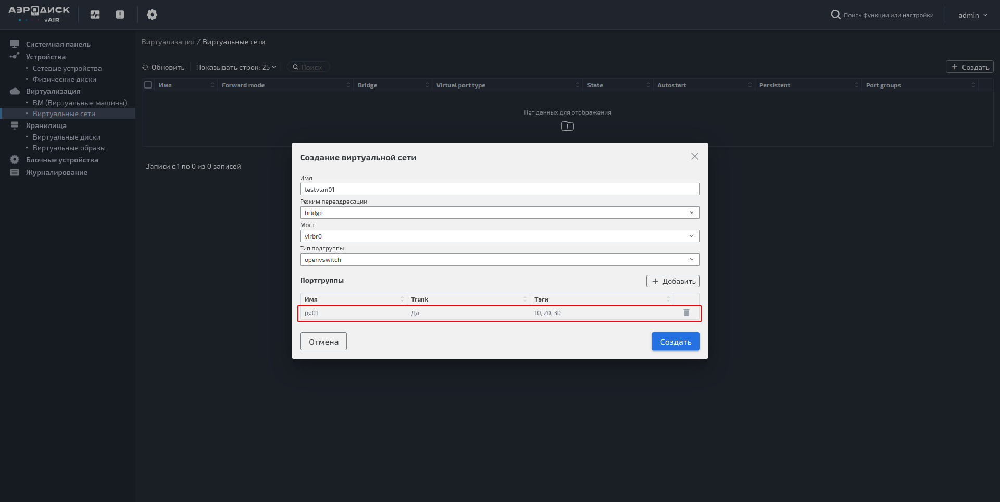
> 1. Видим что в таблице виртуальных сетей добавилась созданная сеть:

> 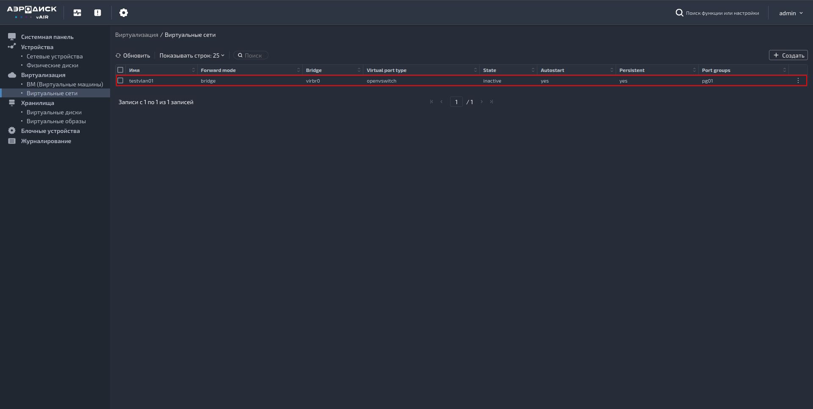

### Добавление портгруппы

> 1. При нажатии на «три точки» в строке с нужной нам виртуальной сетью можно увидеть
     > всплывающее меню. Нажимаем на «Добавить портгруппу»:

> 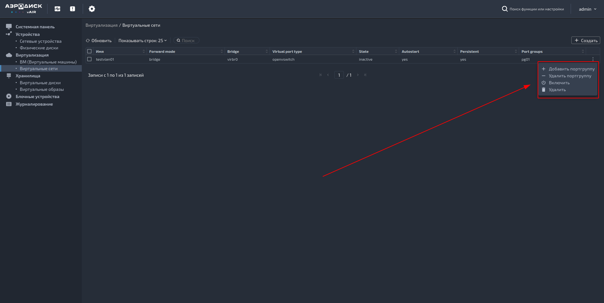
> 1. В появившемся модальном окне добавления портгруппы вводим имя новой портгруппы,
     > добавляем теги и жмем на кнопку «Добавить»:

> 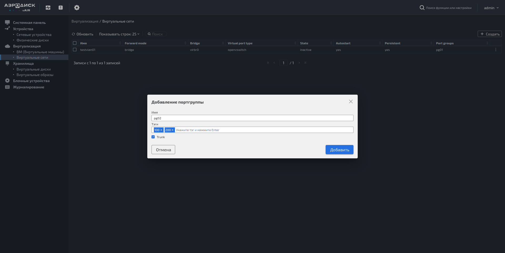
> 1. В таблице виртуальных сетей в столбце «Port groups» видим что добавилось имя только
     > что созданной портгруппы:

> 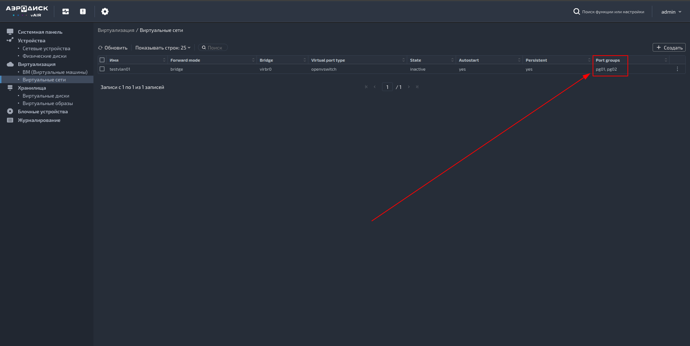

### Удаление портгруппы

> 1. Для удаления портгруппы так же нажимаем на «три точки» и выбираем «Удалить портгруппу».
     > В появившемся модальном окне удаления портгруппы выбираем ту портгруппу, которую
     > хотим удалить, после чего нажимаем на кнопку «Удалить»:

> 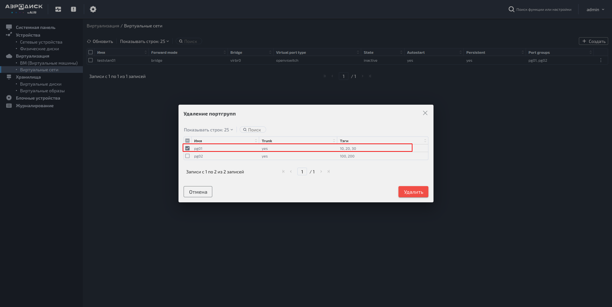
> 1. В таблице виртуальных сетей в столбце «Port groups» видим что удаленная портгруппа
     > больше не отображается:

> 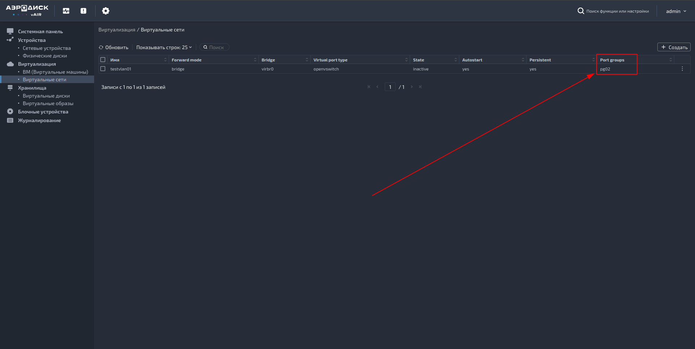

### Включение виртуальной сети

> 1. Для включения виртальнй сети нажимаем на «три точки» и в появившемся меню нажимаем на
     > «Включить»:

> 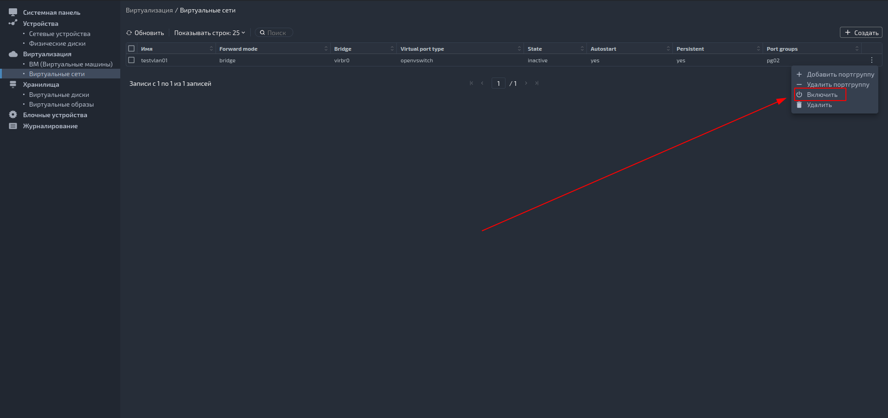
> 1. В окне подтвержения включения виртуальной сети жмем на кнопку «Включить»:

> 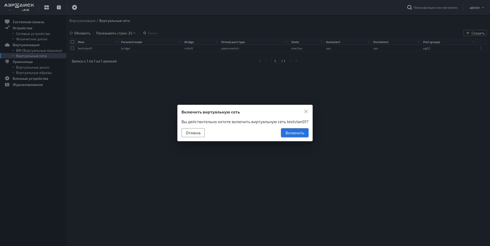
> 1. В таблице виртуальных сетей в столбце «State» видим что статус сменился
     > с «inactive» на «active»:

> 

### Выключение виртуальной сети

> 1. Для выключения виртуальной сети нажмите на «три точки» и в появившемся меню
     > нажмите на «Выключить»:

> 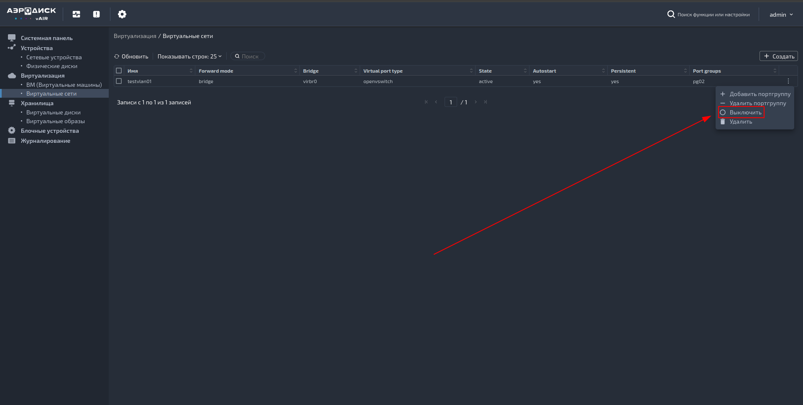
> 1. В таблице виртуальных сетей в столбце «State» видим что статус сменился
     > с «active» на «inactive»:

> 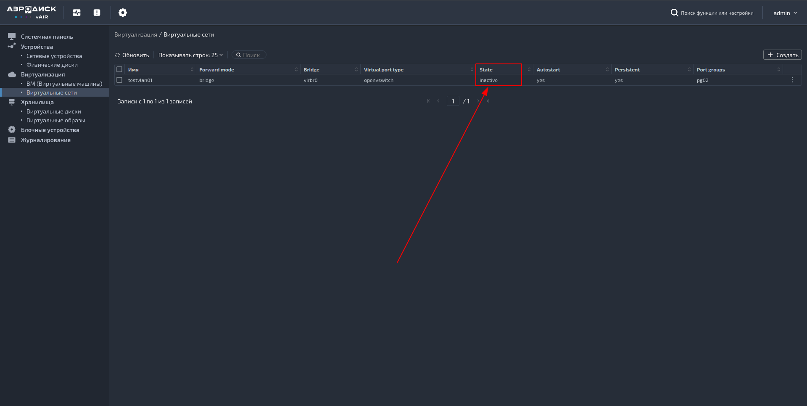
